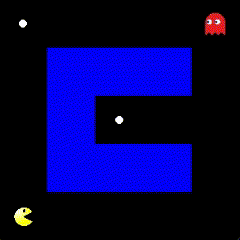

# Pacman Deep Q learning

## Overview

This project implements an AI agent for the classic Pacman game using **Deep Q-Learning (DQN)**. The AI is trained to navigate the Pacman environment, avoid ghosts, and maximize its score by collecting pellets. The project includes the game environment setup, DQN-based agent design, training scripts, and a pre-trained model.

Key features:

- AI agent trained with Deep Q-Learning to make optimal decisions.
- Visualize real-time gameplay, showing the AI agent's decision-making process.
- Tools for retraining or fine-tuning the model with new parameters.

## Project Workflow

1. **Setting up the environment (environment.py):**

- Defines the Pacman environment, including grid layout, walls, pellets, Pacman, and ghost behaviors.
- The environment provides the necessary states, rewards, and actions for the DQN agent.

2. **Designing the agent (agent.py):**

- Implements the DQN algorithm to allow the Pacman agent to learn from its actions and rewards.
- Uses a neural network to approximate the Q-value function, which helps the agent decide the best action in any given state.
- Incorporates experience replay and epsilon-greedy strategy to balance exploration and exploitation during training.

3. **Training the agent (training.py):**

- Trains the Pacman agent in the environment using Deep Q-Learning.
- Saves the trained model as `model.h5` after completing the training process.
- Training can be customized by modifying hyperparameters.

4. **Running the game (game.py):**

- Loads the pre-trained model and runs the Pacman game with the AI agent.
- Visualizes the agent's decision-making process as it navigates through the environment.

## Requirements

To run this project, you need the following dependencies:

- `tensorflow` (for building and running the DQN model)
- `pygame` (for game visualization)
- `numpy`

You can install these dependencies using:

```
pip install tensorflow pygame numpy
```

## How to Run

1. Clone the repository:

```
git clone https://github.com/GrindSC/Pacman-Deep-Q-learning
cd Pacman-Deep-Q-learning
```

2. Train the model (optional):

```
python training.py
```

This will train the DQN agent on the Pacman environment and save the model as `model.h5`.  
3. Run the Pacman game with the trained AI agent:

```
python game.py
```

This will load the trained DQN model and start the Pacman game. The AI agent will play the game while avoiding ghosts and collecting points.

## Example

Below is a comparison of the Pacman AI before and after training using Deep Q-Learning.

|             Initial Pacman Behavior              |                Trained Pacman                |
| :----------------------------------------------: | :------------------------------------------: |
|  |  |

## Future Improvements

- Expanding the environment to include new challenges and increasing the complexity of the game.
- Enhancing the agent's strategy by adding multi-agent learning or adversarial learning with more intelligent ghosts.

## Assets

The `assets` folder contains images and sounds used for the game's graphical interface and sound effects.
